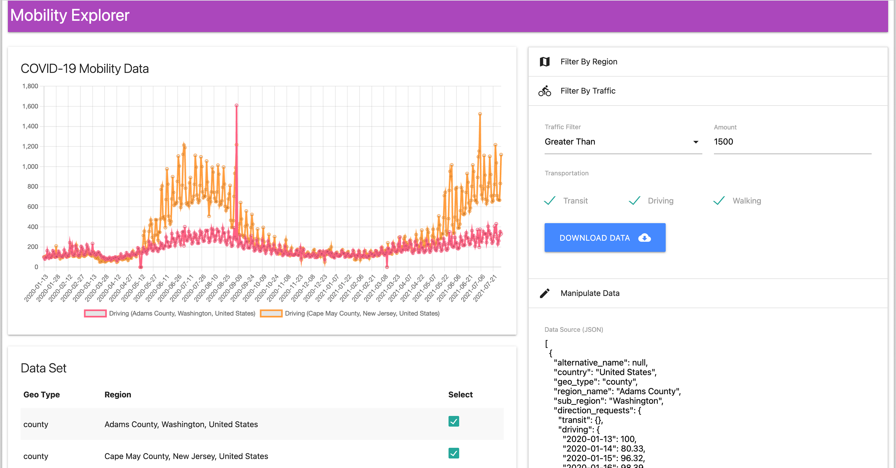

# Mobility-App

## Setup

Install dependencies

```
pipenv shell
pipenv install
```

## Running the app

```
uvicorn main:app --reload
```

Access the site at <http://localhost:8000>.

## Screen Shot




## Common Issues

If you run into issues installing Pandas, try running these commands:

```
pip install cpython --no-use-pep517
pip install numpy --no-use-pep517
pip install pandas --no-use-pep517
```